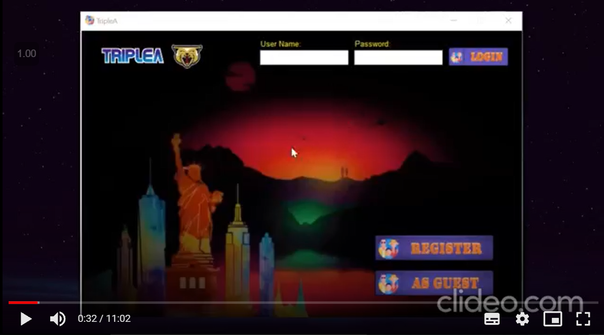
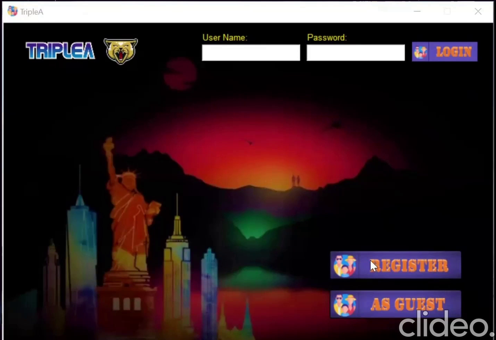
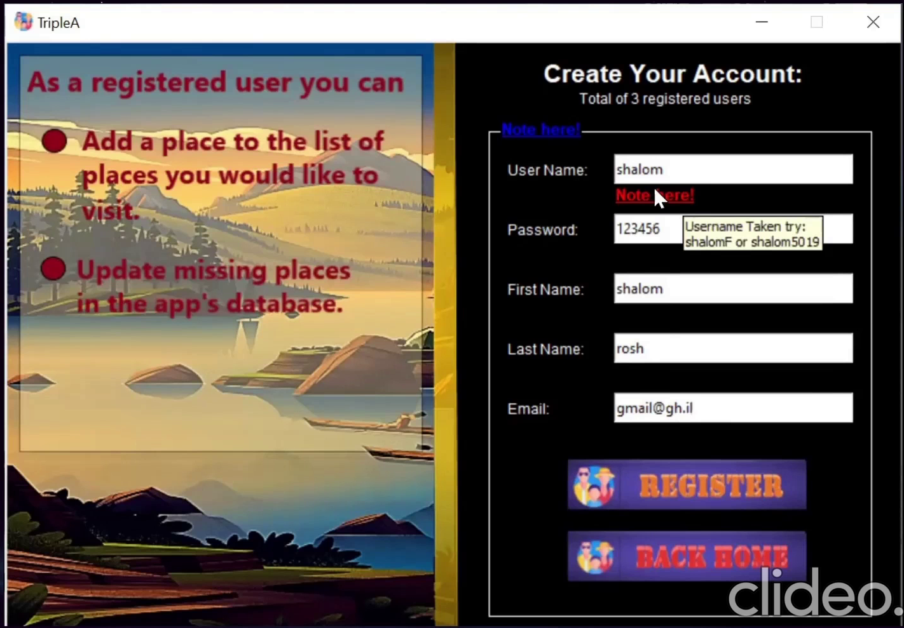
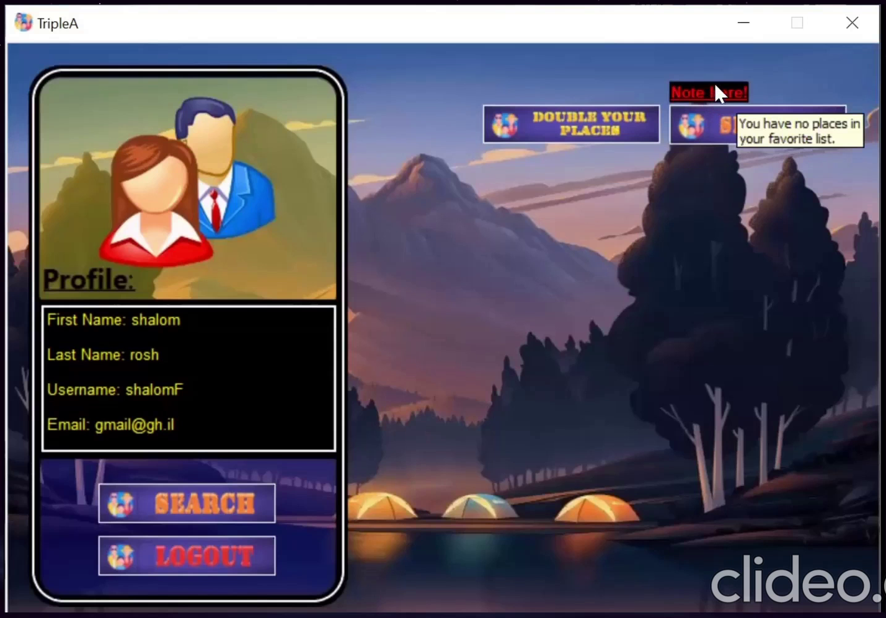
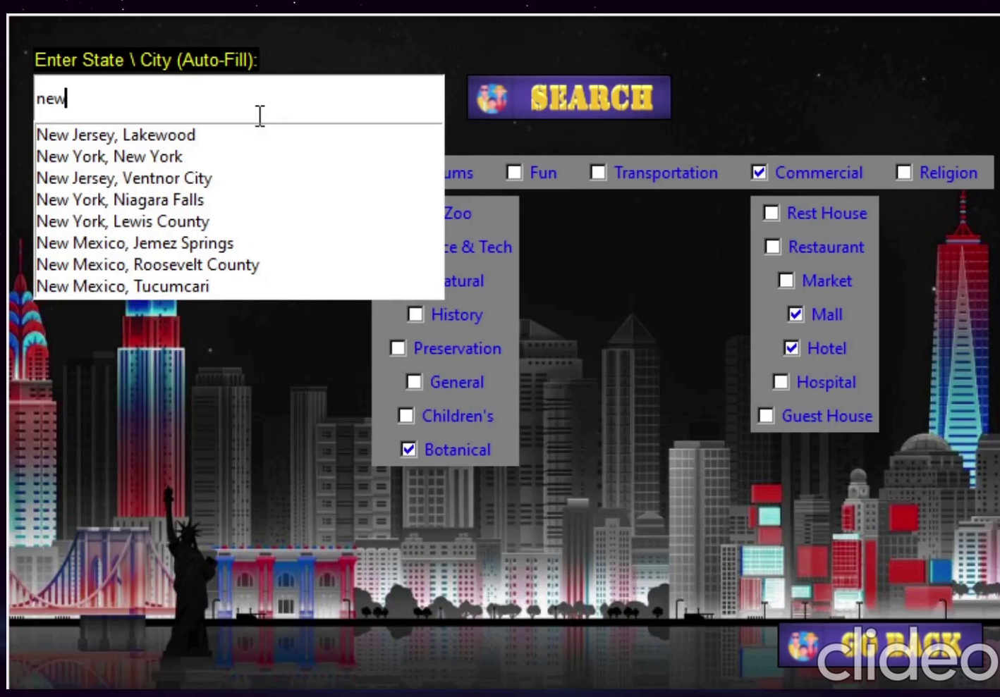
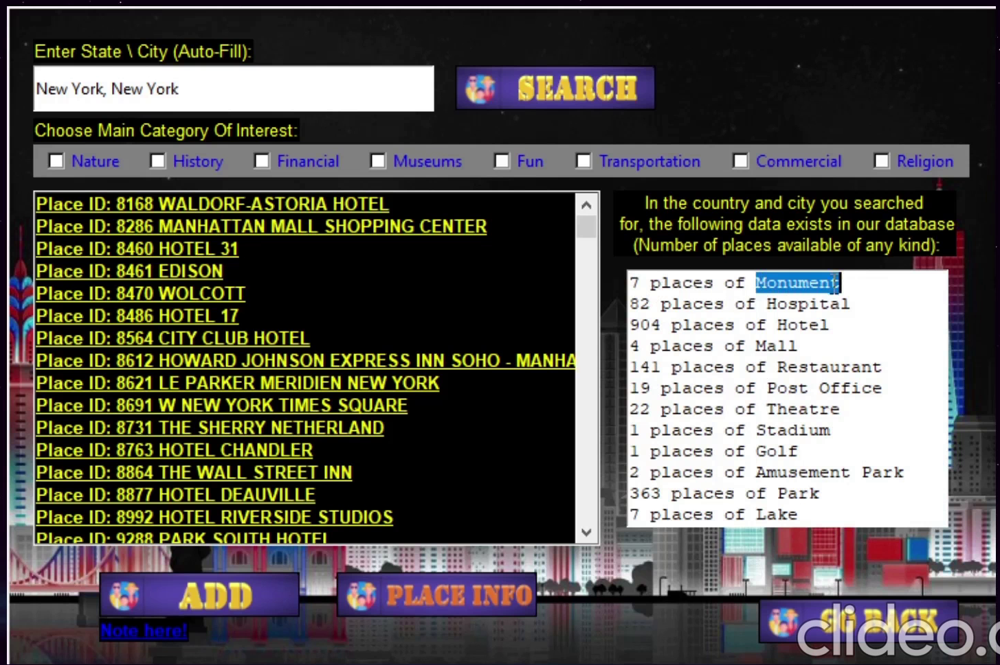
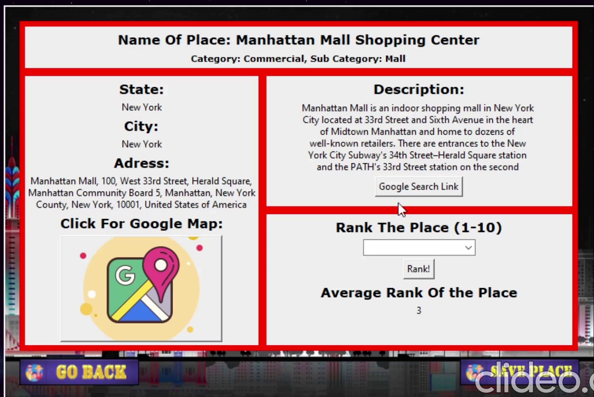
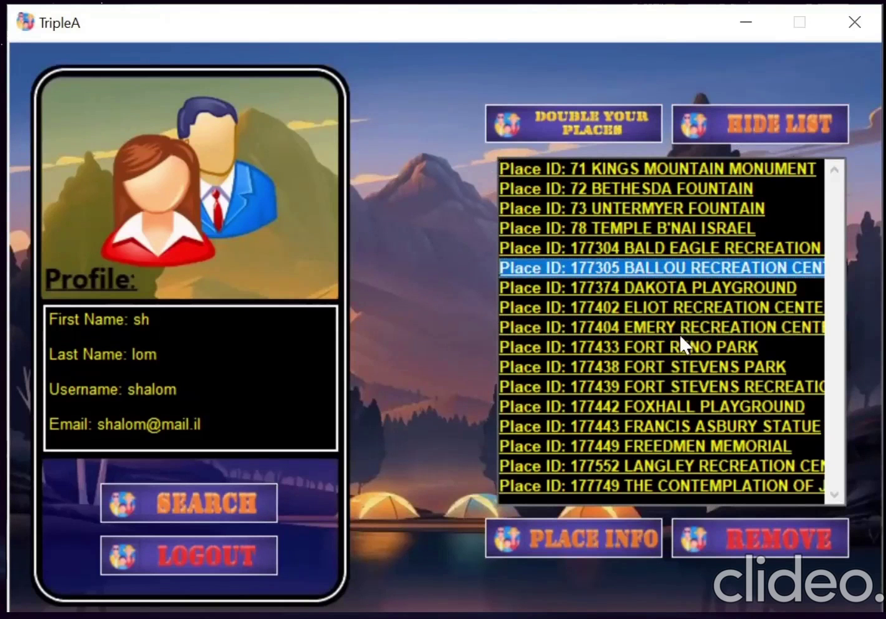
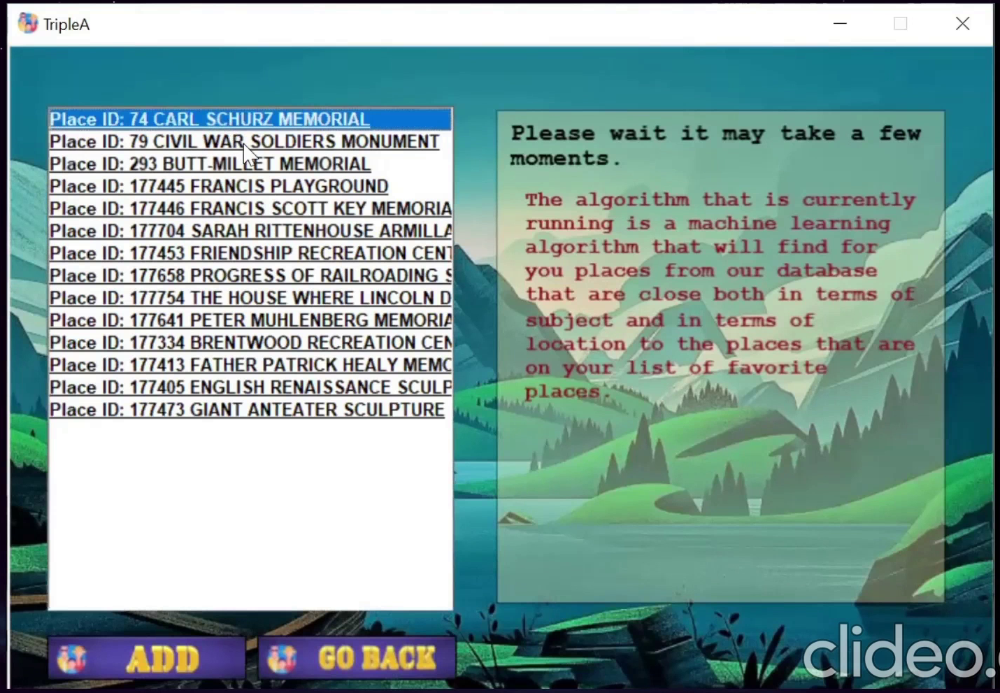

# Triple A

A desktop application for planning trips across the United States. It allows the user to create a profile and save travel destinations. In the database of the app you can find more than a million places, such as cafes, churches, hospitals, restaurants, attractions, etc. In the system, there is an ML algorithm that allows registered users to find places using the same style that they already have. Additionally, registered users have the option to add new places to the app, so that the list of places in the app keeps growing and all other users can use it. In the app, each location is displayed along with a description taken from Wikipedia. The description is added to the database when the user selects the place details. The app is available to all users regardless of registration status and allows them to search for places and find details about them based on their interests. Unregistered users can neither add new places to the app nor keep a private list of places they are interested in visiting.
#### It was developed Python 3.7 programming language. The user interface was created by Tkinter.

<a href="https://drive.google.com/file/d/1PuO4K1wAJwue1v7iuMmOFR5TPq7xYupK/view?usp=sharing">Click to see the video.</a>

**Snapshots**

